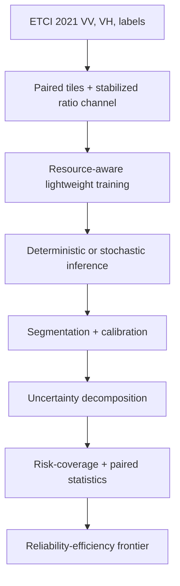

# Small Models, Honest Maps

**Uncertainty-Aware Flood Segmentation from Sentinel-1 for Near-Real-Time Applications**

[](https://github.com/nazizahed/Uncertainty-Aware-Flood-Segmentation-from-Sentinel-1-for-Near-Real-Time-Applications/actions/workflows/tests.yml)

> **Development status:** this independent research project is under active
> development. The data pipeline, model factory, training loop, uncertainty
> utilities, evaluation code, configurations, and Colab entry point are
> implemented. Full lightweight experiments, efficiency benchmarks, ensemble
> experiments, and cross-region results are still pending. This repository does
> not yet claim original model-performance or near-real-time latency results.

The project investigates how much segmentation quality and trustworthy
uncertainty lightweight Sentinel-1 flood models can provide under geographic
shift, and what computational cost is required to obtain it. The primary study
is deliberately designed around free-tier Colab/Kaggle-scale resources rather
than dedicated paid GPU infrastructure.

It builds on Ghosh et al. (2024), [*Automatic Flood Detection from Sentinel-1
Data Using a Nested UNet Model and a NASA Benchmark
Dataset*](https://doi.org/10.1007/s41064-024-00275-1), while using a PyTorch
implementation and an explicitly staged evaluation plan.

The UNet++/EfficientNet-B7 configuration is an **optional reference-aligned
anchor**, not the core experiment and not an exact architectural replication.
It uses the standard `segmentation_models_pytorch` UNet++ rather than the
reference paper's custom pruned/deeply-supervised implementation. The project
is intended to remain scientifically complete even if B7 is impractical on
free infrastructure.

## Research questions

1. **Efficiency:** where is the accuracy-efficiency frontier across model size,
   memory, and CPU/GPU inference latency?
2. **Reliability:** how much do deterministic confidence, MC dropout, and deep
   ensembles improve calibration and failure ranking relative to their extra
   inference cost?
3. **Generalization:** how do segmentation quality and uncertainty estimates
   degrade under geographic distribution shift?
4. **Selective prediction:** when can a model abstain on uncertain pixels and
   reduce risk on the retained flood map?

Near-real-time use is a design objective. It will only be claimed after latency,
throughput, preprocessing, stitching, and end-to-end deployment measurements
are complete.

## Resource-aware experimental strategy

The primary experiments are intentionally lightweight:

| Configuration | Role | Relative burden |
| --- | --- | --- |
| `lightweight_unet_b0.yaml` | compact EfficientNet-B0 baseline | low |
| `lightweight_unet_mobilenetv3.yaml` | very efficient CNN candidate | very low |
| `lightweight_segformer_b0.yaml` | U-Net with MiT-B0 encoder | low-moderate |
| `lightweight_unet_b2.yaml` | intermediate-capacity candidate | moderate |
| `baseline_unetpp_b7.yaml` | optional heavy reference-aligned anchor | high |

Core configs use mixed precision, physical batch size 8, and gradient
accumulation to obtain an effective batch of 32 without requiring large VRAM.
The B7 anchor uses physical batch size 2 with accumulation and remains outside
the critical path.

MC-dropout experiments are also staged: test 5 passes first, then 10, and only
use 20 when lower-pass experiments still show meaningful reliability gains.
Deep ensembles begin with three members of the best lightweight model rather
than five large models.

See [`EXPERIMENT_PLAN.md`](EXPERIMENT_PLAN.md) for the full decision rules and
execution order.

## Implemented workflow



| Component | Current state |
| --- | --- |
| ETCI event discovery and VV/VH/label pairing | Implemented and synthetically tested |
| Stabilized polarization-ratio channel | Implemented and configurable |
| Flood-stratified batches and 90-degree rotations | Implemented |
| UNet and UNet++ model factory | Implemented |
| AMP and gradient accumulation for low-memory training | Implemented |
| Per-tile IoU and boundary evaluation | Implemented |
| Deterministic entropy/confidence baselines | Implemented |
| MC-dropout predictive entropy, expected entropy, mutual information, variance | Implemented |
| ECE, Brier score, risk-coverage, AURC, and sparsification error | Implemented and tested |
| Tile-level Wilcoxon and grouped-bootstrap utilities | Implemented |
| Core lightweight model runs | Pending compute runs |
| Three-member lightweight deep ensemble | Planned after model selection |
| Efficiency and deployment benchmarks | Planned |
| Cross-region evaluation | Planned; external event preparation required |
| Optional B7 anchor | Optional |

## Repository layout

```text
.
|-- configs/                 # Resource-aware and optional anchor experiments
|-- notebooks/               # Colab entry point and notebook guide
|-- scripts/                 # Download, train, evaluate, and UQ commands
|-- src/sarflood/
|   |-- data/                # ETCI discovery, channels, augmentation, sampling
|   |-- models/              # UNet/UNet++ factory and stochastic inference
|   |-- training/            # Losses, metrics, gradient accumulation, training loop
|   |-- uncertainty/         # Calibration and selective-prediction analysis
|   `-- evaluation/          # Evaluation orchestration and paired statistics
|-- tests/                   # Synthetic-data and CPU model smoke tests
|-- EXPERIMENT_PLAN.md       # Compute-aware research protocol
`-- pyproject.toml           # Package metadata and bounded dependencies
```

## Installation

Python 3.10 or newer is recommended.

```bash
git clone https://github.com/nazizahed/Uncertainty-Aware-Flood-Segmentation-from-Sentinel-1-for-Near-Real-Time-Applications.git
cd Uncertainty-Aware-Flood-Segmentation-from-Sentinel-1-for-Near-Real-Time-Applications
python -m venv .venv
source .venv/bin/activate  # Windows: .venv\Scripts\activate
python -m pip install --upgrade pip
python -m pip install -r requirements.txt
```

For CUDA training, install a PyTorch build compatible with the available GPU
before installing the remaining project dependencies.

## Data

The project uses the [NASA IMPACT / IEEE GRSS ETCI 2021 Flood Detection
dataset](https://nasa-impact.github.io/etci2021/): paired Sentinel-1 IW VV/VH
tiles and binary flood labels from five regions. Follow the official competition
page for access conditions, acknowledgement text, and terms of use.

The optional download helper retrieves a documented community mirror. Review
the official terms before using it:

```bash
python scripts/download_data.py --out data/etci
```

The loader recursively supports both the official event layout and the mirror's
additional `data/<split>/<event>/tiles/` nesting. Event directories must contain
`vv/`, `vh/`, and `flood_label/` subdirectories. Data and generated model
artifacts are excluded from Git.

## Recommended execution order

```bash
# 0. Integrity checks
python -m pytest -q
python scripts/validate_repository.py

# 1. Start with the compact baseline
python scripts/train.py --config configs/lightweight_unet_b0.yaml

# 2. Train the remaining core candidates one seed each
python scripts/train.py --config configs/lightweight_unet_mobilenetv3.yaml
python scripts/train.py --config configs/lightweight_segformer_b0.yaml
python scripts/train.py --config configs/lightweight_unet_b2.yaml

# 3. Deterministic Florence evaluation first
python scripts/evaluate.py \
  --checkpoint runs/lightweight_unet_efficientnetb0/best.pt \
  --regions florence \
  --out runs/lightweight_unet_efficientnetb0/florence.json

# 4. Begin MC-dropout with only five passes
python scripts/evaluate.py \
  --checkpoint runs/lightweight_unet_efficientnetb0/best.pt \
  --regions florence \
  --mc-passes 5 \
  --out runs/lightweight_unet_efficientnetb0/florence_mc5.json

# Optional only after the lightweight study is secure
python scripts/train.py --config configs/baseline_unetpp_b7.yaml
```

The Colab workflow is documented in [`notebooks/README.md`](notebooks/README.md).

## Evaluation design

- Florence is held out from model fitting, following the reference study's
  geographic holdout setup.
- Validation metrics are updated **per tile**, avoiding accidental use of the
  batch dimension as a spatial dimension in boundary metrics.
- Segmentation reporting includes pooled accuracy, precision, recall, F1, IoU,
  kappa, boundary F1, and mean per-tile IoU.
- Model selection uses pooled F1 + mean per-tile IoU.
- Calibration uses ECE and Brier score on a bounded reproducible pixel sample,
  with separate flood and non-flood reporting in addition to the overall score.
- Selective prediction compares deterministic entropy/confidence against MC
  predictive entropy, expected entropy, mutual information, and variance using
  risk-coverage curves, AURC, and sparsification error.
- Model comparisons use paired per-tile Wilcoxon tests. Confidence intervals can
  use grouped bootstrap resampling when source-scene or event identifiers are
  available.
- Pixel-level McNemar is retained only for comparison with earlier work because
  spatial autocorrelation inflates nominal pixel counts.

## Development roadmap

- [x] Repository and experiment scaffold
- [x] ETCI pairing, augmentation, ratio channel, and stratified sampling
- [x] Correct per-tile validation and model-selection metrics
- [x] Deterministic and MC-dropout uncertainty decomposition
- [x] Calibration and risk-coverage utilities
- [x] Group-aware statistical comparison utilities
- [x] Resource-aware configs and gradient accumulation
- [x] Synthetic dataset tests and CI
- [ ] Run core lightweight candidates
- [ ] Build lightweight reliability-efficiency frontier
- [ ] Geographic-shift and failure-mode analysis
- [ ] Three-member ensemble of selected lightweight model
- [ ] Latency, throughput, peak-memory, quantization, stitching, and deployment benchmarks
- [ ] Optional B7 reference-aligned anchor
- [ ] Publish versioned results and model cards

## Research integrity and scope

Published values discussed in notebooks are reference values from Ghosh et al.
(2024), not results produced by this repository. Until completed runs and their
artifacts are versioned, the repository should be cited as an ongoing software
and research-method development project.

Code is released under the [MIT License](LICENSE). The dataset and upstream
model weights retain their own licences and usage conditions.
