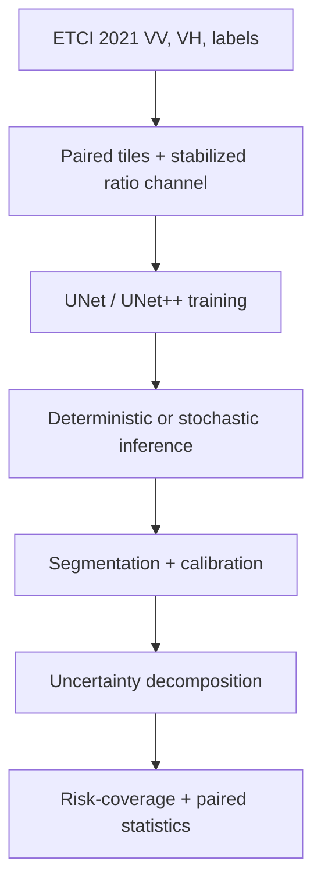

# Small Models, Honest Maps

**Uncertainty-Aware Flood Segmentation from Sentinel-1 for Near-Real-Time Applications**

[](https://github.com/nazizahed/Uncertainty-Aware-Flood-Segmentation-from-Sentinel-1-for-Near-Real-Time-Applications/actions/workflows/tests.yml)

> **Development status:** this independent research project is under active
> development. The data pipeline, model factory, training loop, uncertainty
> utilities, evaluation code, configurations, and Colab entry point are
> implemented. Full reference-aligned baseline runs, efficiency benchmarks,
> ensemble experiments, and cross-region results are still pending. This
> repository does not yet claim original model-performance or near-real-time
> latency results.

The project investigates whether lightweight semantic-segmentation models can
produce useful Sentinel-1 flood maps while making their uncertainty explicit.
It builds on Ghosh et al. (2024), [*Automatic Flood Detection from Sentinel-1
Data Using a Nested UNet Model and a NASA Benchmark
Dataset*](https://doi.org/10.1007/s41064-024-00275-1), while using a PyTorch
implementation and an explicitly staged evaluation plan.

The current UNet++/EfficientNet-B7 configuration is **reference-aligned rather
than an exact architectural replication**. It reproduces the dataset split,
input channels, augmentation, flood-stratified sampling, optimizer/loss family,
and main evaluation conventions, but it uses the standard
`segmentation_models_pytorch` UNet++ rather than the reference paper's custom
pruned/deeply-supervised implementation. Exact replication should only be
claimed if those architecture and model-selection details are reproduced.

## Research questions

1. **Efficiency:** where is the accuracy-efficiency frontier across model size,
   FLOPs, memory, and CPU/GPU inference latency?
2. **Reliability:** how much do deterministic confidence, MC dropout, and deep
   ensembles improve calibration and failure ranking relative to their extra
   inference cost?
3. **Generalization:** how do segmentation quality and uncertainty estimates
   degrade under geographic distribution shift?
4. **Selective prediction:** when can the model abstain on uncertain pixels and
   reduce risk on the retained flood map?

Near-real-time use is a design objective. It will only be claimed after latency,
throughput, preprocessing, stitching, and end-to-end deployment measurements
are complete.

## Implemented workflow



| Component | Current state |
| --- | --- |
| ETCI event discovery and VV/VH/label pairing | Implemented and synthetically tested |
| Stabilized polarization-ratio channel | Implemented and configurable |
| Flood-stratified batches and 90-degree rotations | Implemented |
| UNet and UNet++ model factory | Implemented |
| BCE + soft-Dice training and Florence validation | Implemented |
| Per-tile IoU and boundary evaluation | Implemented |
| Deterministic entropy/confidence baselines | Implemented |
| MC-dropout predictive entropy, expected entropy, mutual information, variance | Implemented |
| ECE, Brier score, risk-coverage, AURC, and sparsification error | Implemented and tested |
| Tile-level Wilcoxon and grouped-bootstrap utilities | Implemented |
| Full reference-aligned baseline run | Pending compute run |
| Deep ensembles | Planned |
| Efficiency and deployment benchmarks | Planned |
| Cross-region evaluation | Planned; external event preparation required |

## Repository layout

```text
.
|-- configs/                 # Reference-aligned and lightweight experiments
|-- notebooks/               # Colab entry point and notebook guide
|-- scripts/                 # Download, train, evaluate, and UQ commands
|-- src/sarflood/
|   |-- data/                # ETCI discovery, channels, augmentation, sampling
|   |-- models/              # UNet/UNet++ factory and stochastic inference
|   |-- training/            # Losses, metrics, and training loop
|   |-- uncertainty/         # Calibration and selective-prediction analysis
|   `-- evaluation/          # Evaluation orchestration and paired statistics
|-- tests/                   # Synthetic-data and CPU model smoke tests
`-- pyproject.toml           # Package metadata and bounded dependencies
```

## Installation

Python 3.10 or newer is recommended.

```bash
git clone https://github.com/nazizahed/Uncertainty-Aware-Flood-Segmentation-from-Sentinel-1-for-Near-Real-Time-Applications.git
cd Uncertainty-Aware-Flood-Segmentation-from-Sentinel-1-for-Near-Real-Time-Applications
python -m venv .venv
source .venv/bin/activate  # Windows: .venv\Scripts\activate
python -m pip install --upgrade pip
python -m pip install -r requirements.txt
```

For CUDA training, install a PyTorch build compatible with the available GPU
before installing the remaining project dependencies.

## Data

The project uses the [NASA IMPACT / IEEE GRSS ETCI 2021 Flood Detection
dataset](https://nasa-impact.github.io/etci2021/): paired Sentinel-1 IW VV/VH
tiles and binary flood labels from five regions. Follow the official competition
page for access conditions, acknowledgement text, and terms of use.

The optional download helper retrieves a documented community mirror. Review
the official terms before using it:

```bash
python scripts/download_data.py --out data/etci
```

The loader recursively supports both the official event layout and the mirror's
additional `data/<split>/<event>/tiles/` nesting. Event directories must contain
`vv/`, `vh/`, and `flood_label/` subdirectories. Data and generated model
artifacts are excluded from Git.

## Reproducible starting points

```bash
# Quick CPU-level integrity and model tests
python -m pytest -q
python scripts/validate_repository.py

# Phase 1 reference-aligned anchor
python scripts/train.py --config configs/baseline_unetpp_b7.yaml

# Lightweight candidate
python scripts/train.py --config configs/lightweight_unet_b0.yaml

# Deterministic Florence evaluation, including deterministic uncertainty baselines
python scripts/evaluate.py \
  --checkpoint runs/baseline_unetpp_efficientnetb7/best.pt \
  --regions florence \
  --out runs/baseline_unetpp_efficientnetb7/florence.json

# MC-dropout evaluation: compares one-pass deterministic uncertainty with
# predictive entropy, expected entropy, mutual information, and MC variance
python scripts/evaluate.py \
  --checkpoint runs/baseline_unetpp_efficientnetb7/best.pt \
  --regions florence \
  --mc-passes 20 \
  --out runs/baseline_unetpp_efficientnetb7/florence_mc20.json
```

The Colab workflow is documented in [`notebooks/README.md`](notebooks/README.md).

## Evaluation design

- Florence is held out from model fitting, following the reference study's
  geographic holdout setup.
- Validation metrics are updated **per tile**, avoiding accidental use of the
  batch dimension as a spatial dimension in boundary metrics.
- Segmentation reporting includes pooled accuracy, precision, recall, F1, IoU,
  kappa, boundary F1, and mean per-tile IoU.
- Model selection uses pooled F1 + mean per-tile IoU.
- Calibration uses ECE and Brier score on a bounded reproducible pixel sample,
  with separate flood and non-flood reporting in addition to the overall score.
- Selective prediction compares deterministic entropy/confidence against MC
  predictive entropy, expected entropy, mutual information, and variance using
  risk-coverage curves, AURC, and sparsification error.
- The selective-prediction oracle is consistent with the reported zero-one
  segmentation risk: erroneous pixels are removed before correct pixels.
- Model comparisons use paired per-tile Wilcoxon tests. Confidence intervals can
  use grouped bootstrap resampling when source-scene or event identifiers are
  available; ordinary tile bootstrap is retained only for cases where tiles can
  reasonably be treated as independent.
- Pixel-level McNemar is retained only for comparison with earlier work because
  spatial autocorrelation inflates nominal pixel counts.

## Development roadmap

- [x] Repository and experiment scaffold
- [x] ETCI pairing, augmentation, ratio channel, and stratified sampling
- [x] Correct per-tile validation and model-selection metrics
- [x] Deterministic and MC-dropout uncertainty decomposition
- [x] Calibration and risk-coverage utilities
- [x] Group-aware statistical comparison utilities
- [x] Synthetic dataset tests and CI
- [ ] Reference-aligned baseline run and recorded environment snapshot
- [ ] Lightweight reliability-efficiency frontier
- [ ] Deep-ensemble training and comparison
- [ ] Cross-region evaluation and failure-mode analysis
- [ ] Latency, throughput, quantization, stitching, and deployment benchmarks
- [ ] Publish versioned results and model cards

## Research integrity and scope

Published values discussed in notebooks are reference values from Ghosh et al.
(2024), not results produced by this repository. Until completed runs and their
artifacts are versioned, the repository should be cited as an ongoing software
and research-method development project.

Code is released under the [MIT License](LICENSE). The dataset and upstream
model weights retain their own licences and usage conditions.
